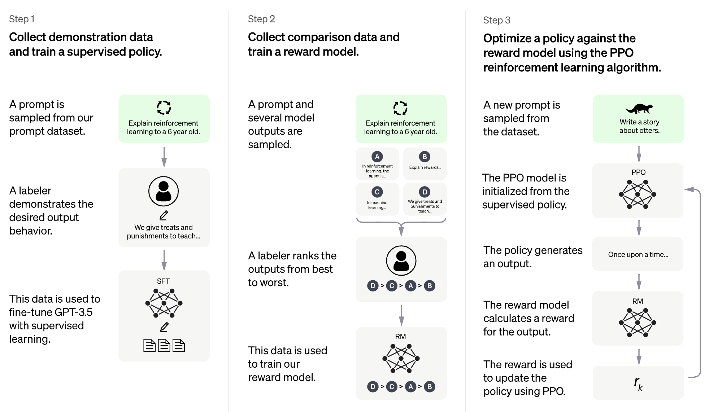
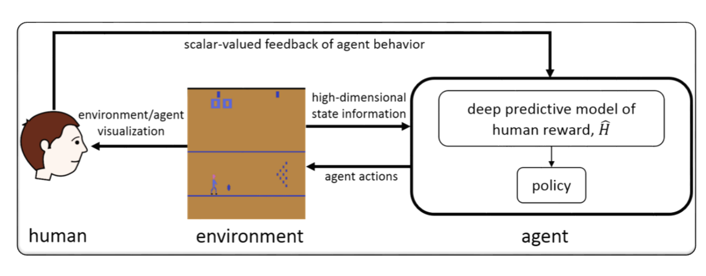

# Awesome RLHF (RL with Human Feedback)
[](https://github.com/sindresorhus/awesome)     [](https://github.com/opendilab/awesome-RLHF/blob/main/LICENSE)

This is a collection of research papers for **Reinforcement Learning with Human Feedback** (RLHF).
And the repository will be continuously updated to track the frontier of RLHF.

Welcome to follow and star!


## Table of Contents

- [Awesome RLHF (RL with Human Feedback)](#awesome-rlhf-rl-with-human-feedback)
  - [Table of Contents](#table-of-contents)
  - [Overview of RLHF](#overview-of-rlhf)
    - [Detailed Explanation](#detailed-explanation)
  - [Papers](#papers)
    - [2025](#2025)
    - [2024](#2024)
    - [2023](#2023)
    - [2022](#2022)
    - [2021](#2021)
    - [2020 and before](#2020-and-before)
  - [Codebases](#codebases)
  - [Dataset](#dataset)
  - [Blogs](#blogs)
  - [Books](#books)
  - [Other Language Support](#other-language-support)
  - [Contributing](#contributing)
  - [License](#license)

## Overview of RLHF

The idea of RLHF is to use methods from reinforcement learning to directly optimize a language model with human feedback. RLHF has enabled language models to begin to align a model trained on a general corpus of text data to that of complex human values.

- RLHF for Large Language Model (LLM)



- RLHF for Video Game (e.g. Atari)



### Detailed Explanation 

**(The following section was automatically generated by ChatGPT)**

RLHF typically refers to "Reinforcement Learning with Human Feedback". Reinforcement Learning (RL) is a type of machine learning that involves training an agent to make decisions based on feedback from its environment. In RLHF, the agent also receives feedback from humans in the form of ratings or evaluations of its actions, which can help it learn more quickly and accurately.

RLHF is an active research area in artificial intelligence, with applications in fields such as robotics, gaming, and personalized recommendation systems. It seeks to address the challenges of RL in scenarios where the agent has limited access to feedback from the environment and requires human input to improve its performance.

Reinforcement Learning with Human Feedback (RLHF) is a rapidly developing area of research in artificial intelligence, and there are several advanced techniques that have been developed to improve the performance of RLHF systems. Here are some examples:

- `Inverse Reinforcement Learning (IRL)`: IRL is a technique that allows the agent to learn a reward function from human feedback, rather than relying on pre-defined reward functions. This makes it possible for the agent to learn from more complex feedback signals, such as demonstrations of desired behavior.

- `Apprenticeship Learning`: Apprenticeship learning is a technique that combines IRL with supervised learning to enable the agent to learn from both human feedback and expert demonstrations. This can help the agent learn more quickly and effectively, as it is able to learn from both positive and negative feedback.

- `Interactive Machine Learning (IML)`: IML is a technique that involves active interaction between the agent and the human expert, allowing the expert to provide feedback on the agent's actions in real-time. This can help the agent learn more quickly and efficiently, as it can receive feedback on its actions at each step of the learning process.

- `Human-in-the-Loop Reinforcement Learning (HITLRL)`: HITLRL is a technique that involves integrating human feedback into the RL process at multiple levels, such as reward shaping, action selection, and policy optimization. This can help to improve the efficiency and effectiveness of the RLHF system by taking advantage of the strengths of both humans and machines.

Here are some examples of Reinforcement Learning with Human Feedback (RLHF):

- `Game Playing`: In game playing, human feedback can help the agent learn strategies and tactics that are effective in different game scenarios. For example, in the popular game of Go, human experts can provide feedback to the agent on its moves, helping it improve its gameplay and decision-making.

- `Personalized Recommendation Systems`: In recommendation systems, human feedback can help the agent learn the preferences of individual users, making it possible to provide personalized recommendations. For example, the agent could use feedback from users on recommended products to learn which features are most important to them.

- `Robotics`: In robotics, human feedback can help the agent learn how to interact with the physical environment in a safe and efficient manner. For example, a robot could learn to navigate a new environment more quickly with feedback from a human operator on the best path to take or which objects to avoid.

- `Education`: In education, human feedback can help the agent learn how to teach students more effectively. For example, an AI-based tutor could use feedback from teachers on which teaching strategies work best with different students, helping to personalize the learning experience.

## Papers

You can also [visit this link](https://codekidz.ai/lesson-intro/awesome-rlhf-367190) to get an AI-enhanced paper reading experience.

```
format:
- [title](paper link) [links]
  - author1, author2, and author3...
  - publisher
  - keyword
  - code
  - experiment environments and datasets
```

### 2025

- [A Simple and Effective Reinforcement Learning Method for Text-to-Image Diffusion Fine-tuning](https://arxiv.org/pdf/2503.00897)
  - Shashank Gupta, Chaitanya Ahuja, Tsung-Yu Lin, Sreya Dutta Roy, Harrie Oosterhuis, Maarten de Rijke, and Satya Narayan Shukla.
  - Keyworks: Diffusion Model, REINFORCE, PPO

- [Differential Information: An Information-Theoretic Perspective on Preference Optimization](https://arxiv.org/abs/2505.23761)
  - Yunjae Won, Hyunji Lee, Hyeonbin Hwang, Minjoon Seo
  - Keyword: Preference Optimization, Information-Theoretic Analysis, Log-Ratio Reward Parameterization, Data Distribution, Log-Likelihood Displacement

- [Generalist Reward Models: Found Inside Large Language Models](https://arxiv.org/abs/2506.23235)
  - Yi-Chen Li, Tian Xu, Yang Yu, Xuqin Zhang, Xiong-Hui Chen, Zhongxiang Ling, Ningjing Chao, Lei Yuan, Zhi-Hua Zhou
  - Keyword: Offline Inverse RL, LLM-as-a-judge, Training-free, Alignment

- [A Unified Pairwise Framework for RLHF: Bridging Generative Reward Modeling and Policy Optimization](https://arxiv.org/abs/2504.04950)
  - Wenyuan Xu, Xiaochen Zuo, Chao Xin, Yu Yue, Lin Yan, Yonghui Wu
  - Keyword: Generative Pairwise Reward Model, Policy Optimization, Framework

- [Exploring Data Scaling Trends and Effects in Reinforcement Learning from Human Feedback](https://arxiv.org/abs/2503.22230)
  - Wei Shen, Guanlin Liu, Zheng Wu, Ruofei Zhu, Qingping Yang, Chao Xin, Yu Yue, Lin Yan
  - Keyword: Data Scaling, Reward Hacking, LLMs

- [RLTHF: Targeted Human Feedback for LLM Alignment](https://arxiv.org/abs/2502.13417)
  - Yifei Xu, Tusher Chakraborty, Emre Kıcıman, Bibek Aryal, Eduardo Rodrigues, Srinagesh Sharma, Roberto Estevao, Maria Angels de Luis Balaguer, Jessica Wolk, Rafael Padilha, Leonardo Nunes, Shobana Balakrishnan, Songwu Lu, Ranveer Chandra
  - Keyword: Human-AI Hybrid Framework, Efficient, Alignment, LLMs

- [Equilibrate RLHF: Towards Balancing Helpfulness-Safety Trade-off in Large Language Models](https://arxiv.org/abs/2502.11555)
  - Yingshui Tan, Yilei Jiang, Yanshi Li, Jiaheng Liu, Xingyuan Bu, Wenbo Su, Xiangyu Yue, Xiaoyong Zhu, Bo Zheng
  - Keyword: Safety, Framework, Adaptive Message-wise Alignment Method, LLMs

- [MM-RLHF: The Next Step Forward in Multimodal LLM Alignment](https://arxiv.org/abs/2502.10391)
  - Yi-Fan Zhang, Tao Yu, Haochen Tian, Chaoyou Fu, Peiyan Li, Jianshu Zeng, Wulin Xie, Yang Shi, Huanyu Zhang, Junkang Wu, Xue Wang, Yibo Hu, Bin Wen, Fan Yang, Zhang Zhang, Tingting Gao, Di Zhang, Liang Wang, Rong Jin, Tieniu Tan
  - Keyword: Critique-based Reward Model, Dynamic Reward, Dataset
  - Code: [Official](https://github.com/Kwai-YuanQi/MM-RLHF)
 
- [Test-Time Preference Optimization: On-the-Fly Alignment via Iterative Textual Feedback](https://arxiv.org/abs/2501.12895)
  - Yafu Li, Xuyang Hu, Xiaoye Qu, Linjie Li, Yu Cheng
  - Keyword: Test-Time Optimization, Preference Learning, Iterative Feedback
  - Code: [Official](https://github.com/yafuly/TPO)
 
- [Segmenting Text and Learning Their Rewards for Improved RLHF in Language Model](https://arxiv.org/abs/2501.02790)
  - Yueqin Yin, Shentao Yang, Yujia Xie, Ziyi Yang, Yuting Sun, Hany Awadalla, Weizhu Chen, and Mingyuan Zhou
  - Keyword: Segment-level Reward Model, Dense Reward RLHF Framework, Improved PPO training for LLMs
  - Code: [Official](https://github.com/yinyueqin/DenseRewardRLHF-PPO)

- [REINFORCE++: A Simple and Efficient Approach for Aligning Large Language Models](https://arxiv.org/abs/2501.03262)
  - Jian Hu
  - Keyword: Efficient, Alignment, Reinforcement Learning
  - Code: [Official](https://github.com/OpenRLHF/OpenRLHF/blob/main/examples/scripts/train_reinforce_llama_ray.sh)

### 2024
- [DPO Meets PPO: Reinforced Token Optimization for RLHF](https://arxiv.org/abs/2404.18922)
  - Han Zhong, Zikang Shan, Guhao Feng, Wei Xiong, Xinle Cheng, Li Zhao, Di He, Jiang Bian, Liwei Wang
  - Keyword: Token-wise Reward, DPO, PPO, RLHF
  - Code: [Official](https://github.com/zkshan2002/RTO)

- [Reward-Augmented Data Enhances Direct Preference Alignment of LLMs](https://arxiv.org/abs/2410.08067)
  - Shenao Zhang, Zhihan Liu, Boyi Liu, Yufeng Zhang, Yingxiang Yang, Yongfei Liu, Liyu Chen, Tao Sun, Zhaoran Wang
  - Keyword: Reward-Augmented Data, DPO, LLMs
  - Code: [Official](https://github.com/shenao-zhang/reward-augmented-preference)

- [The Accuracy Paradox in RLHF: When Better Reward Models Don't Yield Better Language Models](https://aclanthology.org/2024.emnlp-main.174/)
  - Yanjun Chen, Dawei Zhu, Yirong Sun, Xinghao Chen, Wei Zhang, Xiaoyu Shen
  - Keyword: Reward Model Evaluation, Accuracy Paradox, LLM Alignment
  - Code: [Official](https://github.com/EIT-NLP/AccuracyParadox-RLHF)

- [Align Anything: Training All-Modality Models to Follow Instructions with Language Feedback](https://arxiv.org/abs/2412.15838)
  - Jiaming Ji, Jiayi Zhou, Hantao Lou, Boyuan Chen, Donghai Hong, Xuyao Wang, Wenqi Chen, Kaile Wang, Rui Pan, Jiahao Li, Mohan Wang, Josef Dai, Tianyi Qiu, Hua Xu, Dong Li, Weipeng Chen, Jun Song, Bo Zheng, Yaodong Yang
  - Keyword: Multi-modality Alignment, Dataset, Training-evaluation Framework
  - Code: [Official](https://github.com/PKU-Alignment/align-anything)

- [REvolve: Reward Evolution with Large Language Models using Human Feedback](https://arxiv.org/abs/2406.01309)
  - Rishi Hazra, Alkis Sygkounas, Andreas Persson, Amy Loutfi, Pedro Zuidberg Dos Martires
  - Keyword: Improved Reward Model with LLMs, Framework
  - Code: [Official](https://github.com/RishiHazra/Revolve)

- [Zeroth-Order Policy Gradient for Reinforcement Learning from Human Feedback without Reward Inference](https://arxiv.org/abs/2409.17401)
  - Qining Zhang, Lei Ying
  - Keyword: Reward inference-free RLHF, Zeroth-order optimization, Policy gradient

- [Learning Reward and Policy Jointly from Demonstration and Preference Improves Alignment](https://arxiv.org/abs/2406.06874)
  - Chenliang Li, Siliang Zeng, Zeyi Liao, Jiaxiang Li, Dongyeop Kang, Alfredo Garcia, Mingyi Hong
  - Keyword: Joint Reward and Policy, Efficiency, Framework

- [MA-RLHF: Reinforcement Learning from Human Feedback with Macro Actions](https://arxiv.org/abs/2410.02743)
  - Yekun Chai, Haoran Sun, Huang Fang, Shuohuan Wang, Yu Sun, Hua Wu
  - Keyword: Macro action-level Reward, Efficiency, Framework
  - Code: [Official](https://github.com/ernie-research/MA-RLHF)

- [Reward Modeling with Ordinal Feedback: Wisdom of the Crowd](https://arxiv.org/abs/2411.12843)
  - Shang Liu, Yu Pan, Guanting Chen, and Xiaocheng Li
  - Keyword: Reward Modeling, Ordinal Feedback, Human Preference Dataset
  - Code: [Official](https://github.com/LoveCatc/OrdinalRewardModeling)

- [Aligning Few-Step Diffusion Models with Dense Reward Difference Learning](https://arxiv.org/abs/2411.11727)
  - Ziyi Zhang, Li Shen, Sen Zhang, Deheng Ye, Yong Luo, Miaojing Shi, Bo Du, Dacheng Tao
  - Keyword: Diffusion Models, Text-to-Image, Alignment, Reinforcement Learning
  - Code: [Official](https://github.com/ZiyiZhang27/sdpo)

- [HybridFlow: A Flexible and Efficient RLHF Framework](https://arxiv.org/pdf/2409.19256v2)
  - Guangming Sheng, Chi Zhang, Zilingfeng Ye, Xibin Wu, Wang Zhang, Ru Zhang, Yanghua Peng, Haibin Lin, Chuan Wu
  - Keyword: Flexible, Efficient, RLHF framework
  - Code: [Official](https://github.com/volcengine/verl)

- [ALaRM: Align Language Models via Hierarchical Rewards Modeling](https://arxiv.org/abs/2403.06754)
  - Yuhang Lai, Siyuan Wang, Shujun Liu, Xuanjing Huang, Zhongyu Wei
  - Keyword: Hierarchical Reward, Open Text Generation Tasks
  - Code: [Official](https://github.com/halfrot/ALaRM)

- [TLCR: Token-Level Continuous Reward for Fine-grained Reinforcement Learning from Human Feedback](https://arxiv.org/abs/2407.16574)
  - Eunseop Yoon, Hee Suk Yoon, SooHwan Eom, Gunsoo Han, Daniel Wontae Nam, Daejin Jo, Kyoung-Woon On, Mark A. Hasegawa-Johnson, Sungwoong Kim, Chang D. Yoo
  - Keyword: Token-Level Continuous Reward, RLHF
  - Code: [Official]()

- [Aligning Large Multimodal Models with Factually Augmented RLHF](https://arxiv.org/abs/2309.14525)
  - Zhiqing Sun, Sheng Shen, Shengcao Cao, Haotian Liu, Chunyuan Li, Yikang Shen, Chuang Gan, Liang-Yan Gui, Yu-Xiong Wang, Yiming Yang, Kurt Keutzer, Trevor Darrell
  - Keyword: Factually Augmented RLHF, Vision & Language, Human Preference Dataset
  - Code: [Official](https://github.com/llava-rlhf/LLaVA-RLHF)

- [Direct Large Language Model Alignment Through Self-Rewarding Contrastive Prompt Distillation](https://arxiv.org/abs/2402.11907)
  - Aiwei Liu, Haoping Bai, Zhiyun Lu, Xiang Kong, Simon Wang, Jiulong Shan, Meng Cao, Lijie Wen
  - Keyword: Without Human Preference Data, Self-Reward, DPO
  - Code: [Official](https://github.com/exlaw/DLMA)

- [Arithmetic Control of LLMs for Diverse User Preferences: Directional Preference Alignment with Multi-Objective Rewards](https://arxiv.org/abs/2402.18571)
  - Haoxiang Wang, Yong Lin, Wei Xiong, Rui Yang, Shizhe Diao, Shuang Qiu, Han Zhao, Tong Zhang
  - Keyword: User Preference, Multi-objective Reward Model, Rejection Sampling Finetuning
  - Code: [Official](https://github.com/Haoxiang-Wang/directional-preference-alignment)

- [Back to Basics: Revisiting REINFORCE Style Optimization for Learning from Human Feedback in LLMs](https://arxiv.org/abs/2402.14740)
  - Arash Ahmadian, Chris Cremer, Matthias Gallé, Marzieh Fadaee, Julia Kreutzer, Olivier Pietquin, Ahmet Üstün, Sara Hooker
  - Keyword: Online RL Optimization, Low Computational Cost
  - Code: [Official]()

- [Improving Large Language Models via Fine-grained Reinforcement Learning with Minimum Editing Constraint](https://arxiv.org/abs/2401.06081)
  - Zhipeng Chen, Kun Zhou, Wayne Xin Zhao, Junchen Wan, Fuzheng Zhang, Di Zhang, Ji-Rong Wen
  - Keyword: Token-level Reward, LLM
  - Code: [Official](https://github.com/RUCAIBox/RLMEC)
  
- [RLAIF vs. RLHF: Scaling Reinforcement Learning from Human Feedback with AI Feedback](https://proceedings.mlr.press/v235/lee24t.html)
  - Harrison Lee, Samrat Phatale, Hassan Mansoor, Thomas Mesnard, Johan Ferret, Kellie Ren Lu, Colton Bishop, Ethan Hall, Victor Carbune, Abhinav Rastogi, Sushant Prakash
  - Keyword: RL from AI Feedback
  - Code: [official]()

- [Principled Penalty-based Methods for Bilevel Reinforcement Learning and RLHF](https://proceedings.mlr.press/v235/shen24g.html)
  - Han Shen, Zhuoran Yang, Tianyi Chen
  - Keyword: Bilevel optimization
  - Code: [official]()

- [Dense Reward for Free in Reinforcement Learning from Human Feedback](https://openaccess.thecvf.com/content/CVPR2024/html/Yu_RLHF-V_Towards_Trustworthy_MLLMs_via_Behavior_Alignment_from_Fine-grained_Correctional_CVPR_2024_paper.html)
  - Alex James Chan, Hao Sun, Samuel Holt, Mihaela Van Der Schaar
  - Keyword: reward shaping, RLHF
  - Code: [official]( https://github.com/XanderJC/attention-based-credit)

- [A Minimaximalist Approach to Reinforcement Learning from Human Feedback](https://proceedings.mlr.press/v235/swamy24a.html)
  - Gokul Swamy, Christoph Dann, Rahul Kidambi, Steven Wu, Alekh Agarwal
  - Keyword: Minimax Winner, Self-Play Preference Optimization
  - Code: [official]()

- [Rlhf-v: Towards trustworthy mllms via behavior alignment from fine-grained correctional human feedback](https://openaccess.thecvf.com/content/CVPR2024/html/Yu_RLHF-V_Towards_Trustworthy_MLLMs_via_Behavior_Alignment_from_Fine-grained_Correctional_CVPR_2024_paper.html)
  - Tianyu Yu, Yuan Yao, Haoye Zhang, Taiwen He, Yifeng Han, Ganqu Cui, Jinyi Hu, Zhiyuan Liu, Hai-Tao Zheng, Maosong Sun, Tat-Seng Chua
  - Keyword: Multimodal Large Language Models, Hallucination Problem, Reinforcement Learning from Human Feedback
  - Code: [official](https://github.com/RLHF-V/RLHF-V)

- [RLHF Workflow: From Reward Modeling to Online RLHF](https://arxiv.org/abs/2405.07863)
  - Hanze Dong, Wei Xiong, Bo Pang, Haoxiang Wang, Han Zhao, Yingbo Zhou, Nan Jiang, Doyen Sahoo, Caiming Xiong, Tong Zhang
  - Keyword: Online Iterative RLHF, Preference Modeling, Large Language Models
  - Code: [official](https://github.com/RLHFlow/Online-RLHF)

- [MaxMin-RLHF: Towards equitable alignment of large language models with diverse human preferences](https://arxiv.org/abs/2402.08925)
  - Souradip Chakraborty, Jiahao Qiu, Hui Yuan, Alec Koppel, Furong Huang, Dinesh Manocha, Amrit Singh Bedi, Mengdi Wang
  - Keyword: mixture of preference distributions, MaxMin alignment objective
  - Code: [official]()

- [Dataset Reset Policy Optimization for RLHF](https://arxiv.org/abs/2404.08495)
  - Jonathan D. Chang, Wenhao Zhan, Owen Oertell, Kianté Brantley, Dipendra Misra, Jason D. Lee, Wen Sun
  - Keyword: Dataset Reset Policy Optimization
  - Code: [official](https://github.com/Cornell-RL/drpo)

- [A Dense Reward View on Aligning Text-to-Image Diffusion with Preference](https://arxiv.org/pdf/2402.08265)
  - Shentao Yang, Tianqi Chen, Mingyuan Zhou
  - Keyword: RLHF for Text-to-Image Generation, Dense Reward Improvement of DPO, Efficient Alignment
  - Code: [official](https://github.com/Shentao-YANG/Dense_Reward_T2I)

- [Self-Play Fine-Tuning Converts Weak Language Models to Strong Language Models](https://arxiv.org/pdf/2401.01335)
  - Zixiang Chen, Yihe Deng, Huizhuo Yuan, Kaixuan Ji, Quanquan Gu
  - Keyword: Self-Play Fine-Tuning
  - Code: [official](https://github.com/uclaml/SPIN)

- [RLHF Deciphered: A Critical Analysis of Reinforcement Learning from Human Feedback for LLMs](https://arxiv.org/abs/2404.08555)
  - Shreyas Chaudhari, Pranjal Aggarwal, Vishvak Murahari, Tanmay Rajpurohit, Ashwin Kalyan, Karthik Narasimhan, Ameet Deshpande, Bruno Castro da Silva
  - Keyword: RLHF, Oracular Reward, Reward Model Analysis, Survey 

- [Confronting Reward Overoptimization for Diffusion Models: A Perspective of Inductive and Primacy Biases](https://arxiv.org/abs/2402.08552)
  - Ziyi Zhang, Sen Zhang, Yibing Zhan, Yong Luo, Yonggang Wen, Dacheng Tao
  - Keyword: Diffusion Models, Alignment, Reinforcement Learning, RLHF, Reward Overoptimization, Primacy Bias
  - Code: [official](https://github.com/ZiyiZhang27/tdpo)

- [On Diversified Preferences of Large Language Model Alignment](https://arxiv.org/pdf/2312.07401.pdf)
  - Dun Zeng, Yong Dai, Pengyu Cheng, Tianhao Hu, Wanshun Chen, Nan Du, Zenglin Xu
  - Keyword: Aligning shared preference, Reward modeling metrics, LLM
  - Code: [official](https://github.com/dunzeng/MORE)

- [Aligning Crowd Feedback via Distributional Preference Reward Modeling](https://arxiv.org/pdf/2402.09764.pdf)
  - Dexun Li, Cong Zhang, Kuicai Dong, Derrick Goh Xin Deik, Ruiming Tang, Yong Liu
  - Keyword: RLHF, Preference distribution, Aligning, LLM

- [Beyond One-Preference-Fits-All Alignment: Multi-Objective Direct Preference Optimization](https://arxiv.org/pdf/2310.03708.pdf)
  - Zhanhui Zhou, Jie Liu, Chao Yang, Jing Shao, Yu Liu, Xiangyu Yue, Wanli Ouyang, Yu Qiao
  - Keyword: Multi-objective RLHF without reward modeling, DPO
  - Code: [official](https://github.com/ZHZisZZ/modpo/)
  
- [Emulated Disalignment: Safety Alignment for Large Language Models May Backfire!](https://arxiv.org/pdf/2402.12343.pdf)
  - Zhanhui Zhou, Jie Liu, Zhichen Dong, Jiaheng Liu, Chao Yang, Wanli Ouyang, Yu Qiao
  - Keyword: LLM inference-time attack, DPO, Producing harmful LLMs without training
  - Code: [official](https://github.com/ZHZisZZ/emulated-disalignment/)
 
- [A Theoretical Analysis of Nash Learning from Human Feedback under General KL-Regularized Preference](https://arxiv.org/pdf/2402.07314.pdf)
  - Chenlu Ye, Wei Xiong, Yuheng Zhang, Nan Jiang, Tong Zhang
  - Keyword: Game-based RLHF, Nash Learning, Alignment under reward-model-free oracle

- [Mitigating the Alignment Tax of RLHF](https://arxiv.org/pdf/2309.06256.pdf)
  - Yong Lin, Hangyu Lin, Wei Xiong, Shizhe Diao, Jianmeng Liu, Jipeng Zhang, Rui Pan, Haoxiang Wang, Wenbin Hu, Hanning Zhang, Hanze Dong, Renjie Pi, Han Zhao, Nan Jiang, Heng Ji, Yuan Yao, Tong Zhang
  - Keyword: RLHF, Alignment tax, Catastrophic forgetting 

- [Training Diffusion Models with Reinforcement Learning](https://arxiv.org/pdf/2305.13301.pdf)
  - Kevin Black, Michael Janner, Yilun Du, Ilya Kostrikov, Sergey Levine
  - Keyword: reinforcement learning, RLHF, diffusion models
  - Code: [official](http://rl-diffusion.github.io/)

- [AlignDiff: Aligning Diverse Human Preferences via Behavior-Customisable Diffusion Model](https://openreview.net/forum?id=bxfKIYfHyx)
  - Zibin Dong, Yifu Yuan, Jianye Hao, Fei Ni, Yao Mu, Yan Zheng,Yujing Hu, Tangjie Lv, Changjie Fan, Zhipeng Hu
  - Keyword: Reinforcement learning; Diffusion models; RLHF; Preference aligning
  - Code: [official](https://aligndiff.github.io/)

- [Dense Reward for Free in Reinforcement Learning from Human Feedback](https://arxiv.org/pdf/2402.00782)
  - Alex J. Chan, Hao Sun, Samuel Holt, Mihaela van der Schaar
  - Keyword: RLHF
  - Code: [official](https://github.com/XanderJC/attention-based-credit)

- [Transforming and Combining Rewards for Aligning Large Language Models](https://arxiv.org/abs/2402.00742)
  - Zihao Wang, Chirag Nagpal, Jonathan Berant, Jacob Eisenstein, Alex D'Amour, Sanmi Koyejo, Victor Veitch
  - Keyword: RLHF, Aligning, LLM

- [Parameter Efficient Reinforcement Learning from Human Feedback](https://arxiv.org/abs/2403.10704)
  - Hakim Sidahmed, Samrat Phatale, Alex Hutcheson, Zhuonan Lin, Zhang Chen, Zac Yu, Jarvis Jin, Simral Chaudhary, Roman Komarytsia, Christiane Ahlheim, Yonghao Zhu, Bowen Li, Saravanan Ganesh, Bill Byrne, Jessica Hoffmann, Hassan Mansoor, Wei Li, Abhinav Rastogi, Lucas Dixon
  - Keywords: RLHF, Parameter Efficient method, Low Computational Cost, LLM, VLM
 
- [Improving Reinforcement Learning from Human Feedback with Efficient Reward Model Ensemble](https://arxiv.org/abs/2401.16635v2)
  - Shun Zhang, Zhenfang Chen, Sunli Chen, Yikang Shen, Zhiqing Sun, Chuang Gan
  - Keywords: RLHF, Reward Ensemble, Efficient Ensemble Method
  
- [RIME: Robust Preference-based Reinforcement Learning with Noisy Human Preferences](https://arxiv.org/abs/2402.17257)
  - Jie Cheng, Gang Xiong, Xingyuan Dai, Qinghai Miao, Yisheng Lv, Fei-Yue Wang
  - Keyword: 
  - Code: [official](https://github.com/CJReinforce/RIME_ICML2024)
  
- [Uni-RLHF: Universal Platform and Benchmark Suite for Reinforcement Learning with Diverse Human Feedback](https://arxiv.org/abs/2402.02423)
  - Yifu Yuan, Jianye Hao, Yi Ma, Zibin Dong, Hebin Liang, Jinyi Liu, Zhixin Feng, Kai Zhao, Yan Zheng
  - Keyword: 
  - Code: [official](https://github.com/pickxiguapi/Uni-RLHF-Platform)
  - Dataset: [official](https://uni-rlhf.github.io/)

### 2023
- [The Trickle-down Impact of Reward (In-)consistency on RLHF](https://arxiv.org/abs/2309.16155)
  - Lingfeng Shen, Sihao Chen, Linfeng Song, Lifeng Jin, Baolin Peng, Haitao Mi, Daniel Khashabi, Dong Yu
  - Keyword: Reward model, RLHF, Reward hacking
  - Code: [official](https://github.com/shadowkiller33/Contrast-Instruction)

- [A General Theoretical Paradigm to Understand Learning from Human Preferences](https://arxiv.org/abs/2310.12036)
  - Mohammad Gheshlaghi Azar, Mark Rowland, Bilal Piot, Daniel Guo, Daniele Calandriello, Michal Valko, Rémi Munos
  - Keywords: RLHF, Pairwise Preference

- [Fine-Grained Human Feedback Gives Better Rewards for Language Model Training](https://arxiv.org/abs/2306.01693)
  - Zeqiu Wu, Yushi Hu, Weijia Shi, Nouha Dziri, Alane Suhr, Prithviraj Ammanabrolu, Noah A. Smith, Mari Ostendorf, Hannaneh Hajishirzi
  - Keyword: RLHF, Sentence-level Reward, LLM
  - Code: [official](https://github.com/allenai/FineGrainedRLHF)

- [Preference-grounded Token-level Guidance for Language Model Fine-tuning](https://proceedings.neurips.cc/paper_files/paper/2023/file/4d4a3b6a34332d80349137bcc98164a5-Paper-Conference.pdf)
  - Shentao Yang, Shujian Zhang, Congying Xia, Yihao Feng, Caiming Xiong, Mingyuan Zhou
  - Keyword: RLHF, Token-level Training Guidance, Alternate/Online Training Framework, Minimalist Training Objectives
  - Code: [official](https://github.com/Shentao-YANG/Preference_Grounded_Guidance)

- [Fantastic Rewards and How to Tame Them: A Case Study on Reward Learning for Task-oriented Dialogue Systems](https://arxiv.org/pdf/2302.10342)
  - Yihao Feng*, Shentao Yang*, Shujian Zhang, Jianguo Zhang, Caiming Xiong, Mingyuan Zhou, Huan Wang
  - Keyword: RLHF, Genralized Reward Function Learning, Reward Function Utilization, Task-oriented Dialogue System, Learning-to-rank
  - Code: [official](https://github.com/Shentao-YANG/Fantastic_Reward_ICLR2023)

- [Inverse Preference Learning: Preference-based RL without a Reward Function](https://arxiv.org/pdf/2305.15363)
  - Joey Hejna, Dorsa Sadigh
  - Keyword: Inverse Preference Learning, without reward model
  - Code: [official](https://github.com/jhejna/inverse-preference-learning)

- [AlpacaFarm: A Simulation Framework for Methods that Learn from Human Feedback](https://proceedings.neurips.cc/paper_files/paper/2023/file/5fc47800ee5b30b8777fdd30abcaaf3b-Paper-Conference.pdf)
  - Yann Dubois, Chen Xuechen Li, Rohan Taori, Tianyi Zhang, Ishaan Gulrajani, Jimmy Ba, Carlos Guestrin, Percy S. Liang, Tatsunori B. Hashimoto
  - Keyword: RLHF, Simulation Framework
  - Code: [official](https://github.com/tatsu-lab/alpaca_farm)

- [Adversarial Preference Optimization](https://arxiv.org/abs/2311.08045)
  - Pengyu Cheng, Yifan Yang, Jian Li, Yong Dai, Nan Du
  - Keyword: RLHF, GAN, Adversarial Games
  - Code: [official](https://github.com/Linear95/APO)

- [Iterative Preference Learning from Human Feedback: Bridging Theory and Practice for RLHF under KL-Constraint](https://arxiv.org/abs/2312.11456)
  - Wei Xiong, Hanze Dong, Chenlu Ye, Ziqi Wang, Han Zhong, Heng Ji, Nan Jiang, Tong Zhang
  - Keyword: RLHF, Iterative DPO, Mathematical foundation

- [Sample Efficient Reinforcement Learning from Human Feedback via Active Exploration](https://arxiv.org/abs/2312.00267)
  - Viraj Mehta, Vikramjeet Das, Ojash Neopane, Yijia Dai, Ilija Bogunovic, Jeff Schneider, Willie Neiswanger
  - Keyword: RLHF, sample efficience, exploration

- [Reinforcement Learning from Statistical Feedback: the Journey from AB Testing to ANT Testing](https://arxiv.org/abs/2311.14766)
  - Feiyang Han, Yimin Wei, Zhaofeng Liu, Yanxing Qi
  - Keyword: RLHF, AB testing, RLSF

- [A Baseline Analysis of Reward Models' Ability To Accurately Analyze Foundation Models Under Distribution Shift](https://arxiv.org/abs/2311.14743)
  - Ben Pikus, Will LeVine, Tony Chen, Sean Hendryx
  - Keyword: RLHF, OOD, Distribution Shift 

- [Data-Efficient Alignment of Large Language Models with Human Feedback Through Natural Language](https://arxiv.org/abs/2311.14543)
  - Di Jin, Shikib Mehri, Devamanyu Hazarika, Aishwarya Padmakumar, Sungjin Lee, Yang Liu, Mahdi Namazifar
  - Keyword: RLHF, data-efficient, Alignment

- [Let's Reinforce Step by Step](https://arxiv.org/abs/2311.05821)
  - Sarah Pan, Vladislav Lialin, Sherin Muckatira, Anna Rumshisky
  - Keyword: RLHF, reasoning

- [Direct Preference-based Policy Optimization without Reward Modeling](https://arxiv.org/abs/2301.12842)
  - Gaon An, Junhyeok Lee, Xingdong Zuo, Norio Kosaka, Kyung-Min Kim, Hyun Oh Song
  - Keyword: RLHF without reward modeling, Contrastive learning, Offline refinforcement learning

- [AlignDiff: Aligning Diverse Human Preferences via Behavior-Customisable Diffusion Model](https://arxiv.org/abs/2310.02054)
  - Zibin Dong, Yifu Yuan, Jianye Hao, Fei Ni, Yao Mu, Yan Zheng, Yujing Hu, Tangjie Lv, Changjie Fan, Zhipeng Hu
  - Keyword: RLHF, Alignment, Diffusion model

- [Eureka: Human-Level Reward Design via Coding Large Language Models](https://arxiv.org/abs/2310.12931)
  - Yecheng Jason Ma, William Liang, Guanzhi Wang, De-An Huang, Osbert Bastani, Dinesh Jayaraman, Yuke Zhu, Linxi Fan, Anima Anandkumar
  - Keyword: LLM based, reward functions design

- [Safe RLHF: Safe Reinforcement Learning from Human Feedback](https://arxiv.org/abs/2310.12773)
  - Josef Dai, Xuehai Pan, Ruiyang Sun, Jiaming Ji, Xinbo Xu, Mickel Liu, Yizhou Wang, Yaodong Yang
  - Keyword: Sale RL, LLM fine-ture

- [Quality Diversity through Human Feedback](https://arxiv.org/abs/2310.12103)
  - Li Ding, Jenny Zhang, Jeff Clune, Lee Spector, Joel Lehman
  - Keyword: Quality Diversity, Diffusion model

- [ReMax: A Simple, Effective, and Efficient Reinforcement Learning Method for Aligning Large Language Models](https://arxiv.org/abs/2310.10505)
  - Ziniu Li, Tian Xu, Yushun Zhang, Yang Yu, Ruoyu Sun, Zhi-Quan Luo
  - Keyword: computational efficiency, variance-reduction technique

- [Tuning computer vision models with task rewards](https://arxiv.org/abs/2302.08242.pdf)
  - André Susano Pinto, Alexander Kolesnikov, Yuge Shi, Lucas Beyer, Xiaohua Zhai
  - Keyword: Reward tuning in Computer Vision

- [The Wisdom of Hindsight Makes Language Models Better Instruction Followers](https://arxiv.org/pdf/2302.05206.pdf)
  - Tianjun Zhang, Fangchen Liu, Justin Wong, Pieter Abbeel, Joseph E. Gonzalez
  - Keyword: Hindsight Instruction Relabeling, RLHF System, No Value Network Required
  - Code: [official](https://github.com/tianjunz/HIR)

- [Language Instructed Reinforcement Learning for Human-AI Coordination](https://arxiv.org/pdf/2304.07297.pdf)
  - Hengyuan Hu, Dorsa Sadigh
  - Keyword: Human-AI coordination, Human preference alignment, Instruction conditioned RL

- [Aligning Language Models with Offline Reinforcement Learning from Human Feedback](https://arxiv.org/pdf/2308.12050.pdf)
  - Jian Hu, Li Tao, June Yang, Chandler Zhou
  - Keyword: Decision Transformer-based Alignment, Offline Reinforcement Learning, RLHF System

- [Preference Ranking Optimization for Human Alignment](https://arxiv.org/pdf/2306.17492)
  - Feifan Song, Bowen Yu, Minghao Li, Haiyang Yu, Fei Huang, Yongbin Li and Houfeng Wang
  - Keyword: Supervised Human Preference Alignment, Preference Ranking Extension
  - Code: [official](https://github.com/AlibabaResearch/DAMO-ConvAI/tree/main/PRO)

- [Bridging the Gap: A Survey on Integrating (Human) Feedback for Natural Language Generation](https://arxiv.org/abs/2305.00955)
  - Patrick Fernandes, Aman Madaan, Emmy Liu, António Farinhas, Pedro Henrique Martins, Amanda Bertsch, José G. C. de Souza, Shuyan Zhou, Tongshuang Wu, Graham Neubig, André F. T. Martins
  - Keyword: Natural Language Generation, Human Feedback Integration, Feedback Formalization and Taxonomy, AI Feedback and Principles-Based Judgments

- [GPT-4 Technical Report](https://cdn.openai.com/papers/gpt-4.pdf)
  - OpenAI
  - Keyword: A large-scale, multimodal model, Transformerbased model, Fine-tuned used RLHF
  - Code: [official](https://github.com/openai/evals)
  - Dataset: [DROP](https://allenai.org/data/drop), [WinoGrande](https://winogrande.allenai.org/), [HellaSwag](https://rowanzellers.com/hellaswag/), [ARC](https://allenai.org/data/arc), [HumanEval](https://github.com/openai/human-eval), [GSM8K](https://paperswithcode.com/dataset/gsm8k), [MMLU](https://paperswithcode.com/dataset/mmlu), [TruthfulQA](https://github.com/sylinrl/TruthfulQA)

- [RAFT: Reward rAnked FineTuning for Generative Foundation Model Alignment](https://arxiv.org/pdf/2304.06767.pdf)
  - Hanze Dong, Wei Xiong, Deepanshu Goyal, Rui Pan, Shizhe Diao, Jipeng Zhang, Kashun Shum, Tong Zhang
  - Keyword: Rejection Sampling Finetuning, Alternative to PPO, Diffusion Model
  - Code: [official](https://github.com/OptimalScale/LMFlow)
  
- [RRHF: Rank Responses to Align Language Models with Human Feedback without tears](https://arxiv.org/pdf/2304.05302v1.pdf)
  - Zheng Yuan, Hongyi Yuan, Chuanqi Tan, Wei Wang, Songfang Huang, Fei Huang
  - Keyword: New paradigm for RLHF
  - Code: [official](https://github.com/GanjinZero/RRHF)

- [Few-shot Preference Learning for Human-in-the-Loop RL](https://openreview.net/pdf?id=IKC5TfXLuW0)
  - Joey Hejna, Dorsa Sadigh
  - Keyword: Preference Learning, Interactive Learning, Multi-task Learning, Expanding the pool of available data by viewing human-in-the-loop RL
  - Code: [official](https://github.com/jhejna/few-shot-preference-rl)

- [Better Aligning Text-to-Image Models with Human Preference](https://arxiv.org/abs/2303.14420)
  - Xiaoshi Wu, Keqiang Sun, Feng Zhu, Rui Zhao, Hongsheng Li
  - Keyword: Diffusion Model, Text-to-Image, Aesthetic
  - Code: [official](https://github.com/tgxs002/align_sd)

- [ImageReward: Learning and Evaluating Human Preferences for Text-to-Image Generation](https://arxiv.org/pdf/2304.05977v2.pdf)
  - Jiazheng Xu, Xiao Liu, Yuchen Wu, Yuxuan Tong, Qinkai Li, Ming Ding, Jie Tang, Yuxiao Dong
  - Keyword: General-purpose text-to-Image human preference RM, Evaluating Text-to-Image Generative Models
  - Code: [official](https://github.com/THUDM/ImageReward)
  - Dataset: [COCO](https://cocodataset.org/#home), [DiffusionDB](https://poloclub.github.io/diffusiondb/)

- [Aligning Text-to-Image Models using Human Feedback](https://arxiv.org/pdf/2302.12192.pdf)
  - Kimin Lee, Hao liu, MoonKyung Ryu, Olivia Watkins, Yuqing Du, Craig Boutilier, Pieter Abbeel, Mohammad Ghavamzadeh, Shixiang Shane Gu
  - Keyword: Text-to-Image, Stable diffusion model, Reward function that predicts human feedback

- [Visual ChatGPT: Talking, Drawing and Editing with Visual Foundation Models](https://arxiv.org/pdf/2303.04671.pdf)
  - Chenfei Wu, Shengming Yin, Weizhen Qi, Xiaodong Wang, Zecheng Tang, Nan Duan
  - Keyword: Visual Foundation Models, Visual ChatGPT 
  - Code: [official](https://github.com/microsoft/visual-chatgpt)

- [Pretraining Language Models with Human Preferences](https://arxiv.org/abs/2302.08582) (PHF)
  - Tomasz Korbak, Kejian Shi, Angelica Chen, Rasika Bhalerao, Christopher L. Buckley, Jason Phang, Samuel R. Bowman, Ethan Perez
  - Keyword: Pretraining, offline RL, Decision transformer
  - Code: [official](https://github.com/tomekkorbak/pretraining-with-human-feedback)

- [Aligning Language Models with Preferences through f-divergence Minimization](https://arxiv.org/abs/2302.08215) (f-DPG)
  - Dongyoung Go, Tomasz Korbak, Germán Kruszewski, Jos Rozen, Nahyeon Ryu, Marc Dymetman
  - Keyword: f-divergence, RL with KL penalties

- [Principled Reinforcement Learning with Human Feedback from Pairwise or K-wise Comparisons](https://arxiv.org/pdf/2301.11270.pdf)
  - Banghua Zhu, Jiantao Jiao, Michael I. Jordan
  - Keyword: Pessimistic MLE, Max-entropy IRL

- [The Capacity for Moral Self-Correction in Large Language Models](https://arxiv.org/pdf/2302.07459.pdf)
  - Anthropic
  - Keyword: Improve moral self-correction capability by increasing RLHF training
  - Dataset; [BBQ](https://github.com/nyu-mll/BBQ)

### 2022

- [Is Reinforcement Learning (Not) for Natural Language Processing?: Benchmarks, Baselines, and Building Blocks for Natural Language Policy Optimization](https://arxiv.org/abs/2210.01241) (NLPO)
  - Rajkumar Ramamurthy, Prithviraj Ammanabrolu, Kianté,Brantley, Jack Hessel, Rafet Sifa, Christian Bauckhage, Hannaneh Hajishirzi, Yejin Choi
  - Keyword: Optimizing language generators with RL, Benchmark,  Performant RL algorithm
  - Code: [official](https://github.com/allenai/RL4LMs)
  - Dataset: [IMDB](https://www.imdb.com/interfaces/), [CommonGen](https://inklab.usc.edu/CommonGen/), [CNN Daily Mail](https://github.com/abisee/cnn-dailymail), [ToTTo](https://github.com/google-research-datasets/ToTTo), [WMT-16 (en-de)](https://www.statmt.org/wmt16/it-translation-task.html),[NarrativeQA](https://github.com/deepmind/narrativeqa), [DailyDialog](http://yanran.li/dailydialog)
- [Scaling Laws for Reward Model Overoptimization](https://arxiv.org/abs/2210.10760)
  - Leo Gao, John Schulman, Jacob Hilton
  - Keyword: Gold reward model train proxy reward model, Dataset size, Policy parameter size, BoN, PPO
- [Improving alignment of dialogue agents via targeted human judgements](https://arxiv.org/abs/2209.14375) (Sparrow)
  - Amelia Glaese, Nat McAleese, Maja Trębacz, et al.
  - Keyword: Information-seeking dialogue agent, Break down the good dialogue into natural language rules, DPC, Interact with the model to elicit violation of a specific rule (Adversarial Probing)
  - Dataset: [Natural Questions](https://ai.google.com/research/NaturalQuestions), [ELI5](https://facebookresearch.github.io/ELI5/), [QuALITY](https://github.com/nyu-mll/quality), [TriviaQA](http://nlp.cs.washington.edu/triviaqa/), [WinoBias](https://github.com/uclanlp/corefBias/tree/master/WinoBias/wino), [BBQ](https://github.com/nyu-mll/BBQ)
- [Red Teaming Language Models to Reduce Harms: Methods, Scaling Behaviors, and Lessons Learned](https://arxiv.org/abs/2209.07858)
  - Deep Ganguli, Liane Lovitt, Jackson Kernion, et al.
  - Keyword: Red team language model, Investigate scaling behaviors, Read teaming Dataset
  - Code: [official](https://github.com/anthropics/hh-rlhf)
- [Dynamic Planning in Open-Ended Dialogue using Reinforcement Learning](https://arxiv.org/abs/2208.02294)
  - Deborah Cohen, Moonkyung Ryu, Yinlam Chow, Orgad Keller, Ido Greenberg, Avinatan Hassidim, Michael Fink, Yossi Matias, Idan Szpektor, Craig Boutilier, Gal Elidan
  - Keyword: Real-time, Open-ended dialogue system, Pairs the succinct embedding of the conversation state by language models, CAQL, CQL, [BERT](https://github.com/google-research/bert)
- [Quark: Controllable Text Generation with Reinforced Unlearning](https://arxiv.org/abs/2205.13636)
  - Ximing Lu, Sean Welleck, Jack Hessel, Liwei Jiang, Lianhui Qin, Peter West, Prithviraj Ammanabrolu, Yejin Choi
  - Keyword: Fine-tuning the language model on signals of what not to do, Decision Transformer, LLM tuning with PPO
  - Code: [official](https://github.com/gximinglu/quark)
  - Dataset: [WRITINGPROMPTS](https://www.kaggle.com/datasets/ratthachat/writing-prompts), [SST-2](https://huggingface.co/distilbert-base-uncased-finetuned-sst-2-english), [WIKITEXT-103](https://blog.salesforceairesearch.com/the-wikitext-long-term-dependency-language-modeling-dataset/)
- [Training a Helpful and Harmless Assistant with Reinforcement Learning from Human Feedback](https://arxiv.org/abs/2204.05862)
  - Yuntao Bai, Andy Jones, Kamal Ndousse, et al.
  - Keyword: Harmless assistants, Online mode, Robustness of RLHF training, OOD detection.
  - Code: [official](https://github.com/anthropics/hh-rlhf)
  - Dataset: [TriviaQA](http://nlp.cs.washington.edu/triviaqa/), [HellaSwag](https://rowanzellers.com/hellaswag/), [ARC](https://allenai.org/data/arc), [OpenBookQA](https://allenai.org/data/open-book-qa), [LAMBADA](https://zenodo.org/record/2630551#.Y_KLJ-yZNhF), [HumanEval](https://github.com/openai/human-eval), [MMLU](https://github.com/hendrycks/test), [TruthfulQA](https://github.com/sylinrl/TruthfulQA)
- [Teaching language models to support answers with verified quotes](https://arxiv.org/abs/2203.11147) (GopherCite)
  - Jacob Menick, Maja Trebacz, Vladimir Mikulik, John Aslanides, Francis Song, Martin Chadwick, Mia Glaese, Susannah Young, Lucy Campbell-Gillingham, Geoffrey Irving, Nat McAleese
  - Keyword: Generate answers which citing specific evidence, Abstain from answering when unsure
  - Dataset: [Natural Questions](https://ai.google.com/research/NaturalQuestions), [ELI5](https://facebookresearch.github.io/ELI5/), [QuALITY](https://github.com/nyu-mll/quality), [TruthfulQA](https://github.com/sylinrl/TruthfulQA)
- [Training language models to follow instructions with human feedback](https://arxiv.org/abs/2203.02155) (InstructGPT)
  - Long Ouyang, Jeff Wu, Xu Jiang, et al.
  - Keyword: Large Language Model, Align Language Model with Human Intent
  - Code: [official](https://github.com/openai/following-instructions-human-feedback)
  - Dataset: [TruthfulQA](https://github.com/sylinrl/TruthfulQA), [RealToxicityPrompts](https://allenai.org/data/real-toxicity-prompts)
- [Constitutional AI: Harmlessness from AI Feedback](https://arxiv.org/pdf/2212.08073.pdf)
  - Yuntao Bai, Saurav Kadavath, Sandipan Kundu, Amanda Askell, Jackson Kernion, et al.
  - Keyword: RL from AI feedback(RLAIF), Training a harmless AI assistant through selfimprovement, Chain-of-thought style, Control AI behavior more precisely
  - Code: [official](https://github.com/anthropics/ConstitutionalHarmlessnessPaper)
- [Discovering Language Model Behaviors with Model-Written Evaluations](https://arxiv.org/abs/2212.09251)
  - Ethan Perez, Sam Ringer, Kamilė Lukošiūtė, Karina Nguyen, Edwin Chen, et al.
  - Keyword: Automatically generate evaluations with LMs, More RLHF makes LMs worse, LM-written evaluations are highquality
  - Code: [official](https://github.com/anthropics/evals)
  - Dataset: [BBQ](https://github.com/nyu-mll/BBQ), [Winogender Schemas](https://github.com/rudinger/winogender-schemas)
- [Non-Markovian Reward Modelling from Trajectory Labels via Interpretable Multiple Instance Learning](https://arxiv.org/abs/2205.15367)
  - Joseph Early, Tom Bewley, Christine Evers, Sarvapali Ramchurn
  - Keyword: Reward Modelling (RLHF), Non-Markovian, Multiple Instance Learning, Interpretability
  - Code: [official](https://github.com/JAEarly/MIL-for-Non-Markovian-Reward-Modelling)
- [SURF: Semi-supervised Reward Learning with Data Augmentation for Feedback-efficient Preference-based Reinforcement Learning](https://arxiv.org/abs/2203.10050)
  - Jongjin Park, Younggyo Seo, Jinwoo Shin, Honglak Lee, Pieter Abbeel, Kimin Lee
  - Keyword: Semi-supervised Reward Learning, Preference Data Augmentation, RLHF Efficiency
- [Reward Uncertainty for Exploration in Preference-based Reinforcement Learning](https://arxiv.org/abs/2205.12401)
  - Xinran Liang, Katherine Shu, Kimin Lee, Pieter Abbeel
  - Keyword: Preference-based RL (PbRL), Exploration, Reward Uncertainty, Feedback Efficiency
  - Code: [official](https://github.com/rll-research/rune)

### 2021
- [WebGPT: Browser-assisted question-answering with human feedback](https://arxiv.org/abs/2112.09332) (WebGPT)
  - Reiichiro Nakano, Jacob Hilton, Suchir Balaji, et al.
  - Keyword: Model search the web and provide reference， Imitation learning， BC, long form question
  - Dataset: [ELI5](https://facebookresearch.github.io/ELI5/), [TriviaQA](http://nlp.cs.washington.edu/triviaqa/), [TruthfulQA](https://github.com/sylinrl/TruthfulQA)
- [Recursively Summarizing Books with Human Feedback](https://arxiv.org/abs/2109.10862)
  - Jeff Wu, Long Ouyang, Daniel M. Ziegler, Nisan Stiennon, Ryan Lowe, Jan Leike, Paul Christiano
  - Keyword:  Model trained on small task to assist human evaluate broader task, BC
  - Dataset: [Booksum](https://github.com/salesforce/booksum), [NarrativeQA](https://github.com/deepmind/narrativeqa)
- [Revisiting the Weaknesses of Reinforcement Learning for Neural Machine Translation](https://arxiv.org/abs/2106.08942)
  - Samuel Kiegeland, Julia Kreutzer
  - Keyword:  The success of policy gradient is because of reward rather than the shape of output distribution, Machine Translation, NMT, DOmain Adaption
  - Code: [official](https://github.com/samuki/reinforce-joey)
  - Dataset: [WMT15](https://www.statmt.org/wmt15/index.html), [IWSLT14](https://sites.google.com/site/iwsltevaluation2014/mt-track)
- [PEBBLE: Feedback-Efficient Interactive Reinforcement Learning via Relabeling Experience and Unsupervised Pre-training](https://arxiv.org/abs/2106.05091)
  - Kimin Lee, Laura Smith, Pieter Abbeel
  - Keyword: Preference-based RL (PbRL), Data Efficiency, Unsupervised Pretraining, Reward Relabeling
  - Code: [official](https://github.com/rll-research/BPref)
- [B-Pref: Benchmarking Preference-Based Reinforcement Learning](https://arxiv.org/abs/2111.03026)
  - Kimin Lee, Laura Smith, Anca Dragan, Pieter Abbeel
  - Keyword: Benchmark, Preference-based RL, Simulated Human Feedback, Robustness Evaluation
  - Code: [official](https://github.com/rll-research/BPref)

### 2020 and before

- [Learning to summarize from human feedback](https://arxiv.org/abs/2009.01325)
  - Nisan Stiennon, Long Ouyang, Jeff Wu, Daniel M. Ziegler, Ryan Lowe, Chelsea Voss, Alec Radford, Dario Amodei, Paul Christiano
  - Keyword: Care about summary quality, Training loss affect the model behavior, Reward model generalizes to new datasets
  - Code: [official](https://github.com/openai/summarize-from-feedback)
  - Dataset: [TL;DR](https://www.tensorflow.org/datasets/catalog/reddit), [CNN/DM](https://github.com/abisee/cnn-dailymail)
- [Fine-Tuning Language Models from Human Preferences](https://arxiv.org/abs/1909.08593)
  - Daniel M. Ziegler, Nisan Stiennon, Jeffrey Wu, Tom B. Brown, Alec Radford, Dario Amodei, Paul Christiano, Geoffrey Irving
  - Keyword: Reward learning for language, Continuing text with positive sentiment, Summary task, Physical descriptive
  - Code: [official](https://github.com/openai/lm-human-preferences)
  - Dataset: [TL;DR](https://www.tensorflow.org/datasets/catalog/reddit), [CNN/DM](https://github.com/abisee/cnn-dailymail)
- [Scalable agent alignment via reward modeling: a research direction](https://arxiv.org/abs/1811.07871)
  - Jan Leike, David Krueger, Tom Everitt, Miljan Martic, Vishal Maini, Shane Legg
  - Keyword: Agent alignment problem, Learn reward from interaction, Optimize reward with RL, Recursive reward modeling
  - Code: [official](https://github.com/rddy/ReQueST)
  - Env: Atari
- [Reward learning from human preferences and demonstrations in Atari](https://arxiv.org/abs/1811.06521)
  - Borja Ibarz, Jan Leike, Tobias Pohlen, Geoffrey Irving, Shane Legg, Dario Amodei
  - Keyword: Expert demonstration trajectory preferences reward hacking problem, Noise in human label
  - Code: [official](https://github.com/rddy/ReQueST)
  - Env: Atari
- [Deep TAMER: Interactive Agent Shaping in High-Dimensional State Spaces](https://arxiv.org/abs/1709.10163)
  - Garrett Warnell, Nicholas Waytowich, Vernon Lawhern, Peter Stone
  - Keyword:  High dimension state, Leverage the input of Human trainer
  - Code: [third party](https://github.com/bharadwaj1098/Tamer)
  - Env: Atari
- [Deep reinforcement learning from human preferences](https://arxiv.org/abs/1706.03741)
  - Paul Christiano, Jan Leike, Tom B. Brown, Miljan Martic, Shane Legg, Dario Amodei
  - Keyword: Explore goal defined in human preferences between pairs of trajectories segmentation, Learn more complex thing than human feedback
  - Code: [official](https://github.com/mrahtz/learning-from-human-preferences)
  - Env: Atari, MuJoCo
- [Interactive Learning from Policy-Dependent Human Feedback](https://arxiv.org/abs/1701.06049)
  - James MacGlashan, Mark K Ho, Robert Loftin, Bei Peng, Guan Wang, David Roberts, Matthew E. Taylor, Michael L. Littman
  - Keyword: Decision is influenced by current policy rather than human feedback, Learn from policy dependent feedback that converges to a local optimal

## Codebases

```
format:
- [title](codebase link) [links]
  - author1, author2, and author3...
  - keyword
  - experiment environments, datasets or tasks
```

- [Reinforcement Learning from Human Feedback (RLHF) in Notebooks](https://github.com/ash80/RLHF_in_notebooks)
  - Ashwani Kumar
  - step-by-step, Video tutorial, Jupyter notebooks, GPT-2, Reward Model, PPO, Pedagogical
  - Dataset: [stanfordnlp/sst2](https://huggingface.co/datasets/stanfordnlp/sst2)
  - Task: Generating text with positive sentiment
  - Env: Google Colab
- [veRL: Volcano Engine Reinforcement Learning for LLM](https://github.com/volcengine/verl)
  - ByteDance Seed MLSys Team & HKU: Guangming Sheng, Chi Zhang, Zilingfeng Ye, Xibin Wu, Wang Zhang, Ru Zhang, Yanghua Peng, Haibin Lin, Chuan Wu
  - Keyword: Flexible, Efficient, RLHF framework
  - Tasks: RLHF, Reasoning tasks including math and code.
- [OpenRLHF](https://github.com/OpenRLHF/OpenRLHF)
  - OpenRLHF
  - Keyword: 70B, RLHF, DeepSpeed, Ray, vLLM
  - Task: An Easy-to-use, Scalable and High-performance RLHF Framework (Support 70B+ full tuning & LoRA & Mixtral & KTO).
- [PaLM + RLHF - Pytorch](https://github.com/lucidrains/PaLM-rlhf-pytorch)
  - Phil Wang, Yachine Zahidi, Ikko Eltociear Ashimine, Eric Alcaide
  - Keyword: Transformers, PaLM architecture
  - Dataset: [enwik8](http://prize.hutter1.net/)
- [lm-human-preferences](https://github.com/openai/lm-human-preferences)
  - Daniel M. Ziegler, Nisan Stiennon, Jeffrey Wu, Tom B. Brown, Alec Radford, Dario Amodei, Paul Christiano, Geoffrey Irving
  - Keyword: Reward learning for language, Continuing text with positive sentiment, Summary task, Physical  descriptive
  - Dataset: [TL;DR](https://www.tensorflow.org/datasets/catalog/reddit), [CNN/DM](https://github.com/abisee/cnn-dailymail)
- [following-instructions-human-feedback](https://github.com/openai/following-instructions-human-feedback)
  - Long Ouyang, Jeff Wu, Xu Jiang, et al.
  - Keyword: Large Language Model, Align Language Model with Human Intent
  - Dataset: [TruthfulQA](https://github.com/sylinrl/TruthfulQA) [RealToxicityPrompts](https://allenai.org/data/real-toxicity-prompts)
- [Transformer Reinforcement Learning (TRL)](https://github.com/lvwerra/trl)
  - Leandro von Werra, Younes Belkada, Lewis Tunstall, et al.
  - Keyword: Train LLM with RL, PPO, Transformer
  - Task: [IMDB sentiment](https://www.imdb.com/interfaces/)
- [Transformer Reinforcement Learning X (TRLX)](https://github.com/CarperAI/trlx)
  - Jonathan Tow, Leandro von Werra, et al.
  - Keyword: Distributed training framework, T5-based language models, Train LLM with RL, PPO, ILQL
  - Task: Fine tuning LLM with RL using provided reward function or reward-labeled dataset
- [RL4LMs (A modular RL library to fine-tune language models to human preferences)](https://github.com/allenai/RL4LMs)
  - Rajkumar Ramamurthy, Prithviraj Ammanabrolu, Kianté,Brantley, Jack Hessel, Rafet Sifa, Christian Bauckhage, Hannaneh Hajishirzi, Yejin Choi
  - Keyword: Optimizing language generators with RL, Benchmark,  Performant RL algorithm
  - Dataset: [IMDB](https://www.imdb.com/interfaces/), [CommonGen](https://inklab.usc.edu/CommonGen/), [CNN Daily Mail](https://github.com/abisee/cnn-dailymail), [ToTTo](https://github.com/google-research-datasets/ToTTo), [WMT-16 (en-de)](https://www.statmt.org/wmt16/it-translation-task.html), [NarrativeQA](https://github.com/deepmind/narrativeqa), [DailyDialog](http://yanran.li/dailydialog)
- [LaMDA-rlhf-pytorch](https://github.com/conceptofmind/LaMDA-rlhf-pytorch)
  - Phil Wang
  - Keyword: LaMDA, Attention-mechanism
  - Task: Open-source pre-training implementation of Google's LaMDA research paper in PyTorch
- [TextRL](https://github.com/voidful/TextRL)
  - Eric Lam
  - Keyword: huggingface's transformer
  - Task: Text generation
  - Env: PFRL, gym
- [minRLHF](https://github.com/thomfoster/minRLHF)
  - Thomfoster
  - Keyword: PPO, Minimal library
  - Task: educational purposes
- [DeepSpeed-Chat](https://github.com/microsoft/DeepSpeedExamples/tree/master/applications/DeepSpeed-Chat)
  - Microsoft
  - Keyword: Affordable RLHF Training
- [Dromedary](https://github.com/IBM/Dromedary)
  - IBM
  - Keyword: Minimal human supervision, Self-aligned
  - Task: Self-aligned language model trained with minimal human supervision
- [FG-RLHF](https://finegrainedrlhf.github.io/)
  - Zeqiu Wu, Yushi Hu, Weijia Shi, et al.
  - Keyword: Fine-Grained RLHF, providing a reward after every segment, Incorporating multiple RMs associated with different feedback types
  - Task: A framework that enables training and learning from reward functions that are fine-grained in density and multiple RMs
-[Safe-RLHF](https://github.com/PKU-Alignment/safe-rlhf)
  - Xuehai Pan, Ruiyang Sun, Jiaming Ji, et al.
  - Keyword: Support popular pre-trained models, Large human-labeled dataset, Multi-scale metrics for safety constraints verification, Customized parameters
  - Task: Constrained Value-Aligned LLM via Safe RLHF
- [VinePPO](https://github.com/McGill-NLP/VinePPO)
  - Amirhossein Kazemnejad, Milad Aghajohari, et al.
  - Keyword: Performant Implementation of RL algorithms for Reasoning, PPO, DPO, RestEM, Monte Carlo Value Estimation 
  - Task: Reasoning tasks including MATH and GSM8K

## Dataset
```
format:
- [title](dataset link) [links]
  - author1, author2, and author3...
  - keyword
  - experiment environments or tasks
```
- [HH-RLHF](https://github.com/anthropics/hh-rlhf)
  - Ben Mann, Deep Ganguli
  - Keyword: Human preference dataset, Red teaming data, machine-written
  - Task: Open-source dataset for human preference data about helpfulness and harmlessness
- [Stanford Human Preferences Dataset(SHP)](https://huggingface.co/datasets/stanfordnlp/SHP)
  - Ethayarajh, Kawin and Zhang, Heidi and Wang, Yizhong and Jurafsky, Dan
  - Keyword: Naturally occurring and human-written dataset,18 different subject areas
  - Task: Intended to be used for training RLHF reward models
- [PromptSource](https://github.com/bigscience-workshop/promptsource)
  - Stephen H. Bach, Victor Sanh, Zheng-Xin Yong et al.
  - Keyword: Prompted English datasets,  Mapping a data example into natural language
  - Task:  Toolkit for creating, Sharing and using natural language prompts
- [Structured Knowledge Grounding(SKG) Resources Collections](https://unifiedskg.com/)
  - Tianbao Xie, Chen Henry Wu, Peng Shi et al.
  - Keyword: Structured Knowledge Grounding
  - Task:  Collection of datasets are related to structured knowledge grounding
- [The Flan Collection](https://github.com/google-research/FLAN/tree/main/flan/v2)
  - Longpre Shayne, Hou Le, Vu Tu et al.
  - Task: Collection compiles datasets from Flan 2021, P3, Super-Natural Instructions 
- [rlhf-reward-datasets](https://huggingface.co/datasets/yitingxie/rlhf-reward-datasets)
  - Yiting Xie
  - Keyword: Machine-written dataset
- [webgpt_comparisons](https://huggingface.co/datasets/openai/webgpt_comparisons)
  - OpenAI
  - Keyword: Human-written dataset, Long form question answering 
  - Task:  Train a long form question answering model to align with human preferences
- [summarize_from_feedback](https://huggingface.co/datasets/openai/summarize_from_feedback)
  - OpenAI
  - Keyword: Human-written dataset, summarization
  - Task:  Train a summarization model to align with human preferences
- [Dahoas/synthetic-instruct-gptj-pairwise](https://huggingface.co/datasets/Dahoas/synthetic-instruct-gptj-pairwise)
  - Dahoas
  - Keyword: Human-written dataset, synthetic dataset
- [Stable Alignment - Alignment Learning in Social Games](https://github.com/agi-templar/Stable-Alignment)
  - Ruibo Liu, Ruixin (Ray) Yang, Qiang Peng
  - Keyword: Interaction data used for alignment training, Run in Sandbox
  - Task: Train on the recorded interaction data in simulated social games
- [LIMA](https://huggingface.co/datasets/GAIR/lima)
  - Meta AI
  - Keyword: without any RLHF, few carefully curated prompts and responses
  - Task: Dataset used for training the LIMA model


## Blogs

- [OpenAI] [ChatGPT: Optimizing Language Models for Dialogue](https://openai.com/blog/chatgpt)
- [Hugging Face] [Illustrating Reinforcement Learning from Human Feedback (RLHF)](https://huggingface.co/blog/rlhf)
- [ZhiHu] [通向AGI之路：大型语言模型 (LLM) 技术精要](https://zhuanlan.zhihu.com/p/597586623)
- [ZhiHu] [大语言模型的涌现能力：现象与解释](https://zhuanlan.zhihu.com/p/621438653)
- [ZhiHu] [中文hh-rlhf数据集上的ppo实践](https://zhuanlan.zhihu.com/p/652044120)
- [W&B Fully Connected][ Understanding Reinforcement Learning from Human Feedback (RLHF)](https://wandb.ai/ayush-thakur/RLHF/reports/Understanding-Reinforcement-Learning-from-Human-Feedback-RLHF-Part-1--VmlldzoyODk5MTIx)
- [Deepmind] [Learning through human feedback](https://www.deepmind.com/blog/learning-through-human-feedback)
- [Notion] [深入理解语言模型的突现能力](https://yaofu.notion.site/514f4e63918749398a1a8a4c660e0d5b)
- [Notion] [拆解追溯 GPT-3.5 各项能力的起源](https://yaofu.notion.site/GPT-3-5-360081d91ec245f29029d37b54573756#cf00f4e11d974187956122ce7d534386)
- [gist] [Reinforcement Learning for Language Models](https://gist.github.com/yoavg/6bff0fecd65950898eba1bb321cfbd81)
- [YouTube] [John Schulman - Reinforcement Learning from Human Feedback: Progress and Challenges](https://www.youtube.com/watch?v=hhiLw5Q_UFg)
- [OpenAI / Arize] [OpenAI on Reinforcement Learning With Human Feedback](https://arize.com/blog/openai-on-rlhf/)
- [Encord] [Guide to Reinforcement Learning from Human Feedback (RLHF) for Computer Vision](https://encord.com/blog/guide-to-rlhf/)
- [hijkzzz] [A Survey of Reinforcement Learning from Human Feedback (RLHF)](https://hijkzzz.notion.site/a-survey-of-rlhf)
- [Weixun Wang] [Overview of RL(HF)+LLM](https://github.com/wwxFromTju/wwxFromTju.github.io/blob/master/slide/RL(HF)%2BLLM%E7%9A%84%E7%89%87%E9%9D%A2%E8%84%89%E7%BB%9C.JPG)
- [Lilian Weng] [Reward Hacking in Reinforcement Learning](https://lilianweng.github.io/posts/2024-11-28-reward-hacking/)


## Books
- [Reinforcement Learning from Human Feedback by Nathan Lambert](https://rlhfbook.com/)
- [Reinforcement Learning for Business](https://www.manning.com/books/reinforcement-learning-for-business)

## Other Language Support

[Turkish](README_TU.md)

## Contributing

Our purpose is to make this repo even better. If you are interested in contributing, please refer to [HERE](CONTRIBUTING.md) for instructions in contribution.

## License

Awesome RLHF is released under the Apache 2.0 license.
